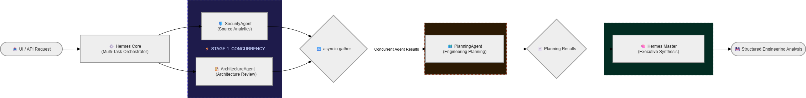

# Hermes Engineering Crew — Engineering Workflow Intelligence

🌐 Live Demo: https://crew.gotihub.com/

🏢 Main Platform: https://gotihub.com/

Built with FastAPI, Next.js, Ollama, Gemma, and Hermes-inspired orchestration workflows.

---

# Overview

Hermes Engineering Crew is a multi-agent AI engineering platform that analyzes GitHub repositories using collaborative AI agents coordinated through a Hermes-inspired orchestration workflow.

Instead of treating AI as a single assistant or chatbot, Hermes Engineering Crew treats software engineering as a collaborative workflow between specialized AI agents.

Each agent focuses on a dedicated engineering responsibility:

- Security Analysis
- Architecture Review
- Engineering Planning
- Final Synthesis Orchestration

The goal is not AI chat.

The goal is engineering workflow intelligence.

---

# Features

- GitHub repository ingestion
- Multi-agent orchestration workflow
- AI-powered security analysis
- Repository architecture review
- Engineering roadmap generation
- Async concurrent agent execution
- Hermes-style synthesis layer
- Telemetry-driven orchestration visibility
- Local AI inference using Ollama
- Optional GitHub token support
- Modern Next.js dashboard
- Structured engineering reports
- Live production deployment

---

# Multi-Agent Orchestration Pipeline



---

# Engineering Workflow Intelligence

Hermes Engineering Crew explores a different direction for AI systems.

Instead of treating AI as a standalone assistant, the platform coordinates specialized AI agents through a centralized orchestration layer.

Each agent focuses on a narrow engineering responsibility while the Hermes Orchestrator manages execution flow, report aggregation, and synthesis.

This creates a collaborative engineering workflow rather than isolated prompt-response interactions.

---

# AI Agents

## Security Analyst Node

Analyzes:
- hardcoded secrets
- insecure configurations
- authentication risks
- dangerous code patterns

---

## Architecture Agent

Reviews:
- repository structure
- modularity
- engineering organization
- architectural consistency

---

## Planning Agent

Generates:
- engineering roadmap
- technical priorities
- next-step recommendations
- optimization opportunities

---

# Real-Time Telemetry Pipeline

Hermes Engineering Crew exposes orchestration telemetry during execution to make multi-agent workflows transparent and observable.

Example runtime telemetry:

```text
[TELEMETRY] GitHubLoader fetched 8 files in 5.91 seconds.

[Orchestrator] Starting Full Pipeline for repository analysis...

[TELEMETRY] Stage 1 (Security + Architecture Agents) took 218.68 seconds.

[TELEMETRY] Stage 2 (Planning Agent Execution) took 72.19 seconds.

[TELEMETRY] Stage 3 (Hermes Master Synthesis API Call) took 120.18 seconds.

[TELEMETRY] Pipeline Complete! Total Runtime: 411.05 seconds.
```

This visibility helps developers understand orchestration timing, model execution latency, and AI workflow coordination behavior.

---

# Tech Stack

## Backend

- FastAPI
- Python
- AsyncIO
- Ollama
- Gemma 3
- Hermes-inspired orchestration architecture

---

## Frontend

- Next.js
- TypeScript
- TailwindCSS
- Lucide React

---

# Production Deployment

Hermes Engineering Crew is deployed using Docker-based infrastructure with isolated frontend, backend, and AI inference layers.

Production stack includes:

- Docker
- Nginx reverse proxy
- Ollama inference server
- FastAPI backend
- Next.js frontend
- Multi-subdomain routing

Live Production URLs:

- https://gotihub.com/
- https://agl.gotihub.com/
- https://crew.gotihub.com/

---

# Current MVP Workflow

1. Enter a GitHub repository URL
2. Hermes Orchestrator loads repository structure
3. AI agents analyze repository
4. Security risks are identified
5. Architecture review is generated
6. Planning Agent creates engineering roadmap
7. Hermes synthesis layer aggregates findings
8. Dashboard displays structured engineering reports

---

# Screenshots

## Dashboard Interface


---

## Loading State


---

## Telemetry Console


---

## Multi-Agent API Response


---

## Swagger Endpoint Testing


---

# Local AI Inference

Hermes Engineering Crew uses:

- Ollama
- Gemma 3 (1B)

for lightweight local inference and privacy-focused AI orchestration workflows.

---

# Run Backend

```bash
cd backend

python -m venv venv

source venv/bin/activate
# Windows:
# venv\Scripts\activate

pip install -r requirements.txt

uvicorn app.main:app --reload
```

Backend runs on:

```text
http://127.0.0.1:8000
```

Swagger docs:

```text
http://127.0.0.1:8000/docs
```

---

# Run Frontend

```bash
cd frontend

npm install

npm run dev
```

Frontend runs on:

```text
http://localhost:3000
```

---

# Environment Variables

Create:

```text
backend/.env
```

Example:

```env
OLLAMA_BASE_URL=http://localhost:11434
OLLAMA_MODEL=gemma3:1b
OLLAMA_TIMEOUT=300

MAX_REPO_FILES=8
MAX_FILE_CONTENT_LENGTH=800
```

---

# Project Status

- GitHub Loader ✅
- AI Security Agent ✅
- Architecture Agent ✅
- Planning Agent ✅
- Hermes Orchestrator ✅
- Next.js Dashboard ✅
- Local Gemma Inference ✅
- Real-Time Telemetry UI ✅
- Docker Deployment ✅
- Live Production Deployment ✅

---

# Vision

Hermes Engineering Crew explores collaborative AI engineering workflows where specialized AI agents work together to analyze, review, and improve software repositories.

The project focuses on orchestration transparency, engineering workflow intelligence, and practical multi-agent system design.

---

# Support The Project

If you find Hermes Engineering Crew interesting, helpful, or inspiring, consider supporting the project by starring the repository.

⭐ GitHub Repository:
https://github.com/apurba-labs/gotihub-hermes-crew

🌐 Live Demo:
https://crew.gotihub.com/

Your support helps us continue exploring engineering workflow intelligence, multi-agent orchestration systems, and practical AI engineering infrastructure.

---

# License

MIT